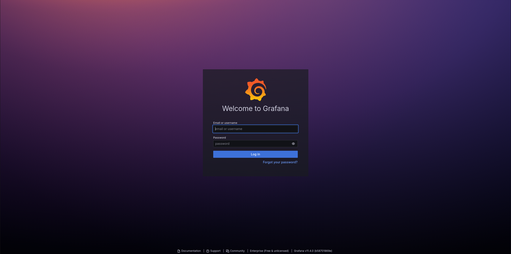
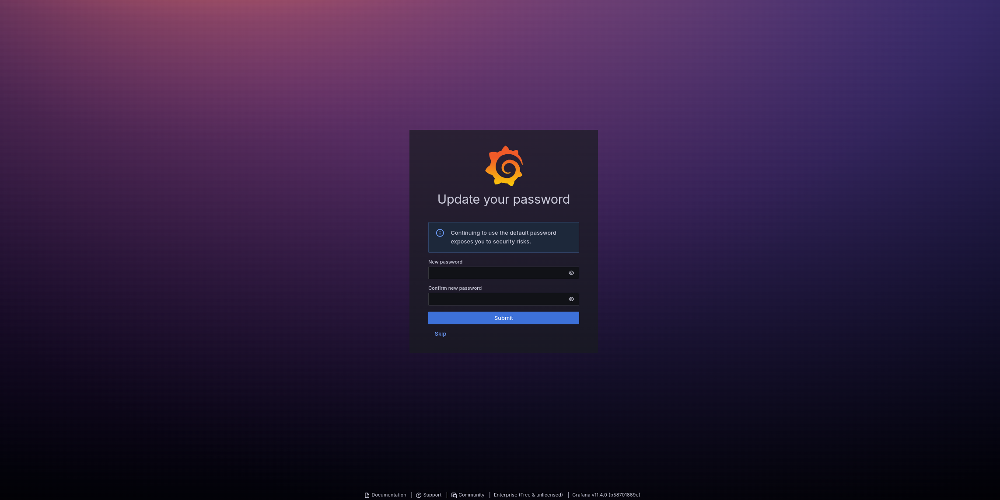
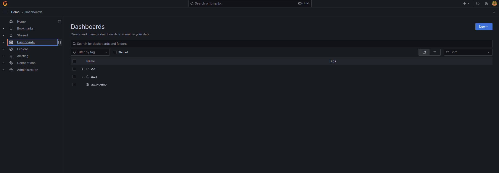
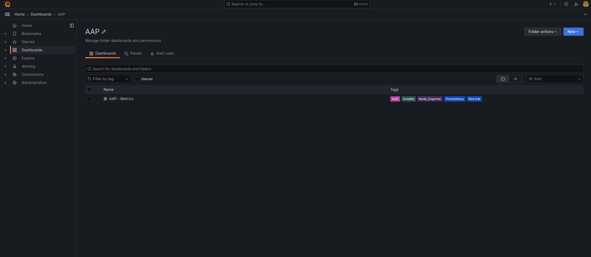
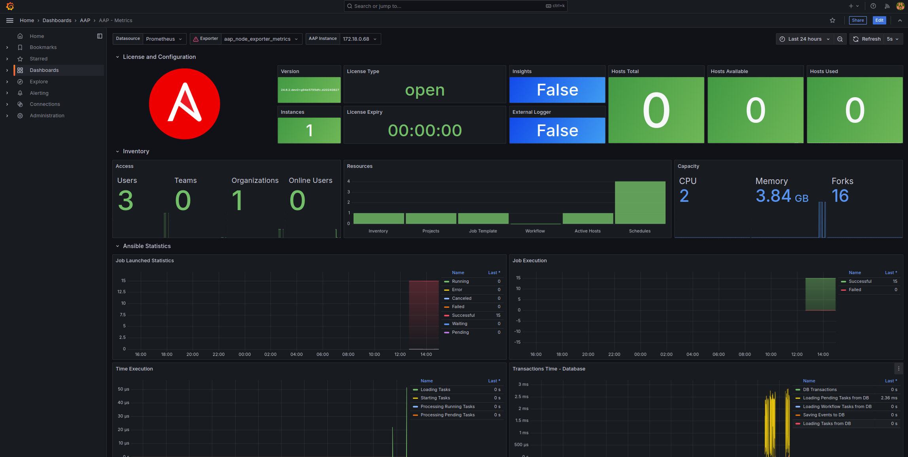

  
#### This repository contains scripts to deploy awx grafana and prometheus as a container stack for ansible automation platform via docker or podman.
* [AAP metrics](https://developers.redhat.com/articles/2024/08/28/monitor-ansible-automation-platform-using-prometheus-node-exporter-and-grafana?source=sso#procedure)
* [AWX prometheus and grafana](https://github.com/ansible/awx/blob/devel/tools/grafana/README.md)

#### Configure aap-metrics account
1. https://aap > Access > Users > Add
```
First Name = aap-metrics
Username   = aap-metrics
User Type  = System Auditor
* Set password
```
2. Logout and log back in with aap-metrics account
3. Access > Users > aap-metrics > Tokens > Add 
* Save token

#### Deploy aap-metrics
1. git clone project
2. cd redhat_aap_metrics
3. vim prometheus_config/prometheus.yml
* Update bearer token and target
```
---
global:
  scrape_interval: 5s  # Set the scrape interval to something faster. Default is every 1 minute.

scrape_configs:
  - job_name: 'aap-controller'
    metrics_path: /api/v2/metrics
    scrape_interval: 5s
    scheme: https
    tls_config:
      insecure_skip_verify: true
    bearer_token: PV5nc5rboRBFhbp6sEFtoxDzMegsvJ # Update bearer token
    static_configs:
    # AAP Endpoint
    - targets: ['172.18.0.68']                   # Update to either aap IP or FQDN
```
4. ./deploy_aap_metrics_podman.sh
5. http://ip:3001 > admin admin > forces you to set a new password





6. http://ip:3001 > admin admin > Dashboards > AAP > AAP Metrics








